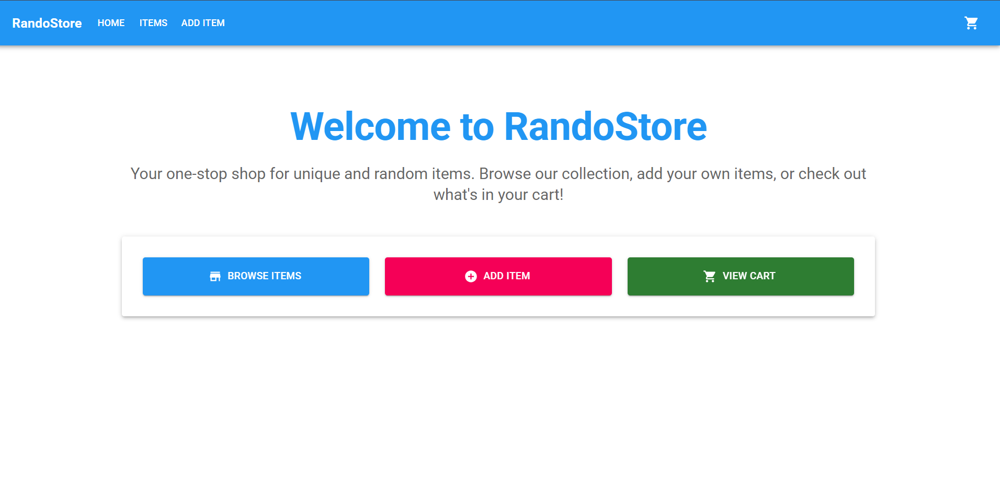

# RandoStore

## ✅ Project Overview
RandoStore is a modern, full-stack e-commerce platform designed to showcase a seamless shopping experience. It features a dynamic frontend built with React, complemented by a robust Node.js backend. The application allows users to browse items, add new products with image uploads, manage a persistent shopping cart, and experience real-time updates and animations, providing a rich and interactive user interface.

## 🧰 Tech Stack

### Frontend
- **React 18**: For building the user interface.
- **Vite**: As the build tool for a fast development experience.
- **Material UI 5**: For a modern, elegant, and responsive UI design.
- **Bootstrap 5**: Integrated for additional styling and responsiveness.
- **Framer Motion**: For smooth and engaging animations.
- **React Router DOM**: For client-side routing.
- **Axios**: For making HTTP requests to the backend.
- **React Hot Toast**: For user notifications.
- **Context API**: For state management, particularly for the shopping cart.

### Backend
- **Node.js**: The runtime environment.
- **Express**: Web framework for building the REST API.
- **Multer**: Middleware for handling multipart/form-data, primarily for file uploads.
- **body-parser, cookie-parser, debug, lodash, serve-favicon, winston**: Supporting libraries for various functionalities.

### Development & Build Tools
- **concurrently**: To run frontend and backend development servers simultaneously.
- **Vite (build)**: For optimizing and bundling frontend assets (CSS/JS bundling, manual chunking).


## ✨ Features

### Frontend Features
- **Dynamic Item Listing**: Displays products fetched from the backend with real-time updates.
- **Add Item Form**: A dedicated page for adding new products with client-side validation for name, price, and image.
- **Image Upload**: Supports image uploads (JPG/PNG, max 2MB) with a live preview before submission. Images are stored in the `/static/img/` directory on the server.
- **Dynamic Cart in Top Navbar**: A shopping cart icon in the navigation bar dynamically updates to show the number of items in the cart.
- **Local Storage Support & Tab Persistence**: The shopping cart state is persisted across sessions and browser tabs using `localStorage`.
- **Real-time List Updates**: Items list updates dynamically without requiring a page refresh after adding or deleting items.
- **Sorting & Searching**: Users can search for items by name and sort them by price (low to high, high to low).
- **Responsive UI**: Adapts to various screen sizes, providing an optimal viewing experience on desktops, tablets, and mobile devices.
- **Animations**: Utilizes Framer Motion for subtle and engaging UI animations, such as button hovers, card transitions, and page entry animations.
- **Checkout Page**: Displays cart items, allows quantity adjustments, item removal, and calculates the total price.
- **User Notifications**: Uses `react-hot-toast` for success/error messages.

### Backend Features
- **REST API (`/items`)**: Provides endpoints for fetching, adding, updating, and deleting product items.
- **Static File Hosting**: Serves static assets, including images and the built frontend application.
- **Image Upload Handling**: Processes image uploads via `multer`, saving them to the `/static/img/` directory and associating them with product data.
- **Image Deletion**: Automatically deletes associated image files when an item is removed from the Items.
- **Error Handling**: Robust error handling for API requests and file operations.

## 🔄 Application Flow
1. **User Access**: The user accesses the application via the frontend URL (e.g., `http://localhost:5173`).
2. **Home Page**: Displays a welcome message and navigation options to browse items, add items, or view the cart.
3. **Browse Items**: Users navigate to the `/items` page, which fetches product data from the backend's `/items` API. Items are displayed in a grid, with options for searching and sorting.
4. **Add New Item**: On the `/add-item` page, users fill out a form, including an image upload. The frontend validates the input, and upon submission, sends a `multipart/form-data` request to the backend's `/items` endpoint. The backend saves the image and item data.
5. **Shopping Cart**: Users can add items to their cart from the items list. The cart count updates in the navbar. The cart state is managed using React Context and persisted in `localStorage`.
6. **Checkout**: The `/checkout` page displays all items in the cart, allowing users to adjust quantities or remove items. The total price is dynamically calculated. A "Checkout" button provides a placeholder for a purchase action.
7. **Backend Operations**: The Node.js backend handles all API requests, including serving item data, processing image uploads, and managing item persistence.


## 🚀 How to Run the Project

### Prerequisites
- Node.js (v16+ recommended)
- npm (v8+ recommended)

### Installation
1. **Clone the repository**:
   ```bash
   git clone https://github.com/your-org/ProductBox-Frontend-Challenge.git
   cd ProductBox-Frontend-Challenge
   ```
2. **Install backend dependencies**:
   ```bash
   npm install
   ```
3. **Install frontend dependencies**:
   ```bash
   cd frontend
   npm install
   cd ..
   ```

### Running Locally
To run both the frontend and backend simultaneously:
```bash
npm run dev
```

Alternatively, you can run them in separate terminals:

**Backend (from root directory)**:
```bash
npm run dev:backend
```

**Frontend (from root directory)**:
```bash
cd frontend
npm run dev
```

Access the application:
- **Frontend**: `http://localhost:5173`
- **Backend API**: `http://localhost:3000/items`

## 📁 Folder Structure
```
ProductBox-Frontend-Challenge/
├── .gitattributes
├── README.md
├── frontend/                  # React frontend application
│   ├── index.html
│   ├── package.json
│   ├── package-lock.json
│   ├── src/
│   │   ├── App.jsx
│   │   ├── components/        # Reusable React components (e.g., Navbar, ItemCard)
│   │   ├── contexts/          # React Contexts (e.g., CartContext)
│   │   ├── index.css          # Global CSS styles
│   │   ├── main.jsx           # Main entry point for React app
│   │   └── pages/             # React pages (e.g., Home, Items, AddItem, Checkout)
│   └── vite.config.js         # Vite configuration for frontend
├── index.js                   # Main backend server file
├── init_data.json             # Initial data for items
├── lib/                       # Backend utility functions (e.g., logger)
├── license
├── package-lock.json
├── package.json               # Backend dependencies and scripts
├── routes/                    # Backend API routes (e.g., items.js)
└── static/                    # Static files served by backend
    ├── add-items.html         # Legacy HTML for adding items
    ├── checkout.html          # Legacy HTML for checkout
    ├── img/                   # Uploaded images are stored here
    │   ├── bed.jpg
    │   ├── cookies.jpg
    │   ├── rack.jpg
    │   ├── slippers.jpg
    │   └── sticks.jpg
    ├── index.html             # Legacy HTML homepage
    └── items.html             # Legacy HTML for items
```

## 🎯 Challenges & Learnings
- **Full-stack Integration**: Successfully connecting a React frontend with a Node.js/Express backend, including API communication and static file serving.
- **Image Uploads**: Implementing secure and efficient image upload functionality using Multer, including file type and size validation.
- **State Management with Context API**: Managing global state for the shopping cart and ensuring persistence across sessions.
- **Dynamic UI with Material UI & Framer Motion**: Leveraging Material UI components for a consistent design system and integrating Framer Motion for enhanced user experience through animations.
- **Optimized Build Process**: Configuring Vite for efficient bundling and code splitting to improve application performance.
- **Real-time UI Updates**: Implementing mechanisms to update the item list dynamically after CUD operations without full page reloads.


- **User Authentication**: Implement user registration and login functionalities.
- **Database Integration**: Replace `init_data.json` with a persistent database (e.g., MongoDB, PostgreSQL) for item and user data.
- **Payment Gateway Integration**: Integrate a real payment processing system for checkout.
- **Admin Dashboard**: Create an admin interface for managing products, orders, and users.
- **Advanced Search & Filtering**: Add more sophisticated search capabilities, including category filtering and price range sliders.
- **Product Details Page**: A dedicated page for each product with more detailed information and multiple images.

## 📷 Screenshots




